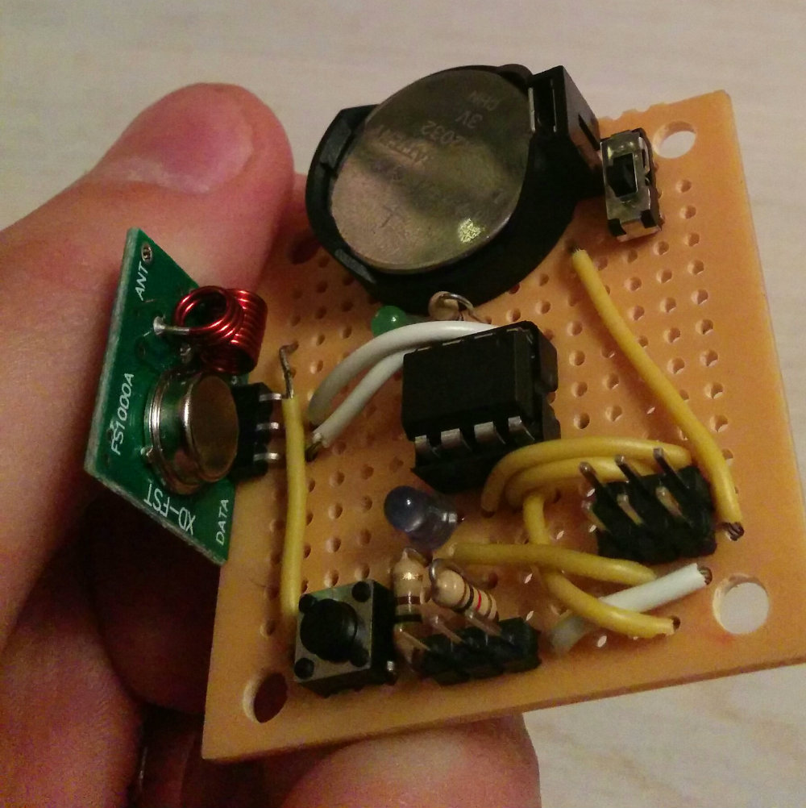
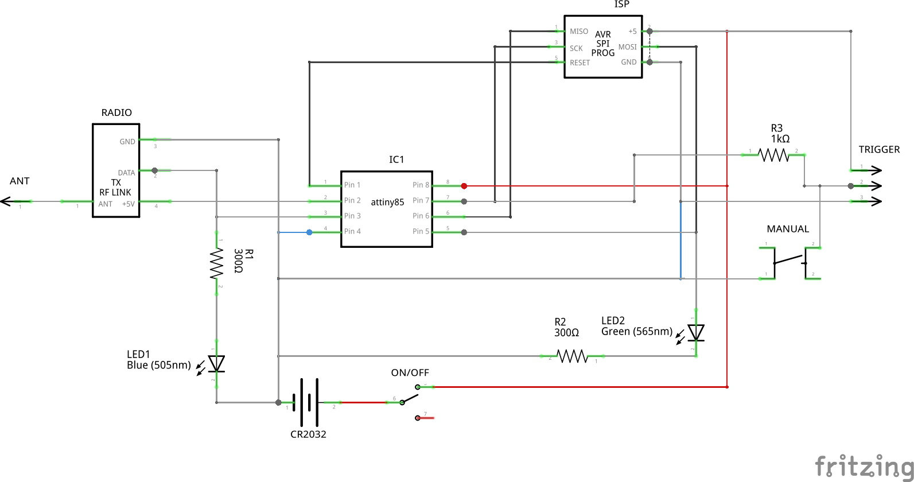
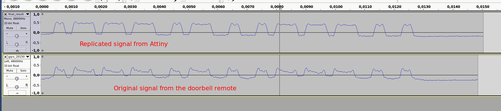

# Tiny Doorbell Remote

These are the project files (hardware schematic and Arduino firmware code) for a small remote-control module that acts as an auxiliary remote to a wireless doorbell.

## Hardware

The hardware is built around the Attiny85 IC and a cheap [434 RF link transmitter](https://www.sparkfun.com/products/10534).

A Fritzing schematic is in the [hardware](hardware) folder.

The circuit runs on a single 3V battery and consumes

- 65 μA while on standby mode
- 7.5mA while transmitting

Estimated battery lifetime: at least 60 days.

## Signal

The decoded signal for my doorbell was `0000111010011100` (or `0E9C` in hex). The original and replicated signal recordings are in the [signal-recordings](signal-recordings) folder. Open them with [Audacity](http://audacityteam.org).

## API

There are some general guidelines and files in the [api](api) directory for creating a HTTP POST endpoint on a Raspberry Pi, to control the module via the web.

## Links

- [Best ways to power a Arduino according to your need](http://www.homautomation.org/2014/04/03/best-ways-to-power-a-arduino-according-to-your-need)
- [Low-Power ATtiny](https://learn.sparkfun.com/tutorials/h2ohno/low-power-attiny)
- [Digital Ding Dong Ditch](http://samy.pl/dingdong) by [@SamyKamkar](https://twitter.com/samykamkar)
- [REV 0046830 doorbell](http://www.rev.de/product_4480.ahtml)

## Licence

[MIT](LICENCE)